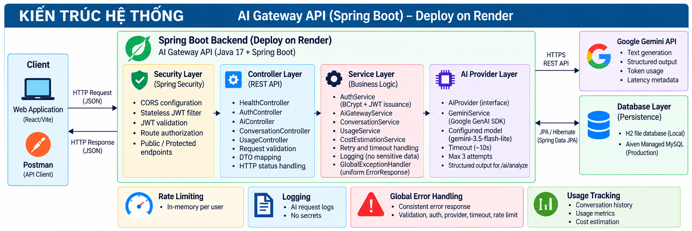
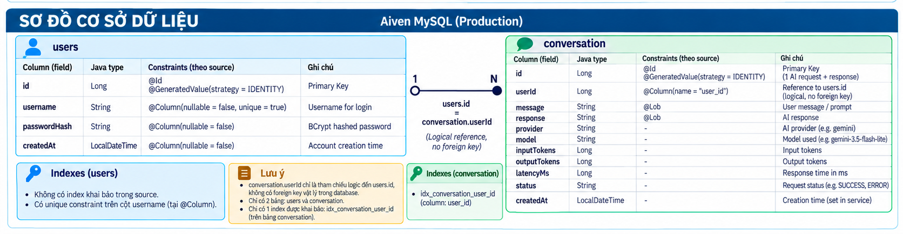

# AI Gateway API

AI Gateway là centralized backend API nằm giữa client và AI provider. Client không cần gọi Gemini trực tiếp; gateway xử lý authentication, AI requests, conversation history, usage tracking, reliability và rate limiting qua một API thống nhất.

Project được xây dựng cho Backend Intern Challenge bằng Java 17, Spring Boot 3.5.16 và Maven. Gemini là provider duy nhất hiện tại; abstraction `AiProvider` cho phép mở rộng provider trong tương lai nhưng chưa triển khai routing hoặc fallback.

## Demo trực tuyến

- Backend: <https://ai-gateway-ck7w.onrender.com>
- Swagger UI: <https://ai-gateway-ck7w.onrender.com/swagger-ui/index.html>
- Health: <https://ai-gateway-ck7w.onrender.com/health>

Render Free có thể cần một khoảng thời gian ngắn để wake up sau khi không hoạt động.

## Tính năng chính

- Register/Login với JWT authentication stateless.
- Hash password bằng BCrypt; không lưu plaintext password.
- AI chat với Google Gemini.
- Structured text analysis với schema và validation rõ ràng.
- Lưu AI request/response, provider, model, token usage, latency và status.
- Conversation history và usage metrics được cô lập theo authenticated user.
- Cost estimation theo pricing configuration; không tự giả định giá khi thiếu cấu hình.
- Timeout, retry có giới hạn và global error handling.
- In-memory rate limiting theo user cho các AI endpoint.
- Logging tối thiểu cho AI request và rate-limit event, không log secret.
- Swagger/OpenAPI và Postman collection.
- H2 file database cho local; Aiven Managed MySQL cho production.
- Multi-stage Docker build và deployment trên Render.

## Kiến trúc hệ thống

Luồng AI request chính:

```text
Client
  -> Spring Security / JwtAuthenticationFilter
  -> RateLimitInterceptor
  -> AiController
  -> AiGatewayService
  -> AiProvider
  -> GeminiService
  -> Google Gemini API
```

Luồng persistence:

```text
Controller / Service
  -> Spring Data JPA / Hibernate
  -> H2 file database (local)
     hoặc Aiven Managed MySQL (production)
```

`AiController` lưu đúng một `Conversation` record cho kết quả cuối cùng của mỗi request, kể cả khi Gemini thực hiện retry nội bộ. `AiGatewayService` phụ thuộc vào interface `AiProvider`; `GeminiService` là implementation duy nhất đang được cấu hình.

Sơ đồ Mermaid chi tiết: [docs/architecture.md](docs/architecture.md).



## Database

Source hiện có đúng hai JPA entity/table:

- `User` -> table `users`: lưu `id`, unique `username`, BCrypt `passwordHash` và `createdAt`. `passwordHash` được loại khỏi JSON serialization.
- `Conversation` -> table `conversation`: lưu input `message`, `response`, `status`, `createdAt`, `provider`, `model`, `inputTokens`, `outputTokens`, `latencyMs` và `userId`.

`Conversation.userId` là scalar logical reference lấy từ JWT principal, không phải `@ManyToOne` và không có physical foreign key trong JPA mapping. Table `conversation` có index `idx_conversation_user_id` trên column `user_id`. Các query history và usage đều lọc theo authenticated `userId`.

Sơ đồ Mermaid chi tiết: [docs/database-schema.md](docs/database-schema.md).



## API

| Method | Endpoint | Authentication | Mô tả |
|---|---|---|---|
| `GET` | `/health` | Public | Kiểm tra service đang hoạt động, không gọi Gemini. |
| `POST` | `/auth/register` | Public | Tạo user mới và lưu BCrypt password hash. |
| `POST` | `/auth/login` | Public | Xác minh credentials và trả JWT có hiệu lực 24 giờ. |
| `POST` | `/ai/chat` | Bearer JWT | Gửi message đến Gemini và trả text response. |
| `POST` | `/ai/analyze` | Bearer JWT | Phân tích text và trả structured output. |
| `GET` | `/conversations` | Bearer JWT | Lấy AI request history của user hiện tại. |
| `GET` | `/usage` | Bearer JWT | Lấy usage metrics và cost estimation của user hiện tại. |

Swagger/OpenAPI cũng public tại `/swagger-ui/index.html` và `/v3/api-docs`. Mọi route khác không được khai báo trong `SecurityConfig` đều bị từ chối.

## Ví dụ sử dụng API

Đặt base URL local trong PowerShell:

```powershell
$baseUrl = "http://localhost:8080"
```

### Register

```powershell
curl.exe -X POST "$baseUrl/auth/register" `
  -H "Content-Type: application/json" `
  -d '{"username":"demo","password":"password123"}'
```

Register thành công trả HTTP `201` với `id` và `username`; response không chứa password hash.

### Login

```powershell
curl.exe -X POST "$baseUrl/auth/login" `
  -H "Content-Type: application/json" `
  -d '{"username":"demo","password":"password123"}'
```

Response gồm `token` và `tokenType: "Bearer"`. Dùng token trả về cho protected endpoints; không đưa JWT thật vào source hoặc README.

### AI Chat

```powershell
curl.exe -X POST "$baseUrl/ai/chat" `
  -H "Content-Type: application/json" `
  -H "Authorization: Bearer <JWT_TOKEN>" `
  -d '{"message":"Explain REST API in one sentence."}'
```

### Structured Analyze

```powershell
curl.exe -X POST "$baseUrl/ai/analyze" `
  -H "Content-Type: application/json" `
  -H "Authorization: Bearer <JWT_TOKEN>" `
  -d '{"text":"Users report that checkout is extremely slow."}'
```

Analyze response có đúng bốn field: `summary`, `sentiment`, `category` và `priority`.

## Authentication

```text
Register -> validate input -> BCrypt hash -> users table
Login -> verify BCrypt hash -> JWT (subject, userId, issuedAt, expiration)
Protected request -> Bearer token -> JwtAuthenticationFilter
                  -> AuthenticatedUser -> SecurityContext -> Controller
```

- JWT dùng `JWT_SECRET` từ environment và yêu cầu secret tối thiểu 32 bytes.
- Token chứa username trong subject và `userId` claim, hết hạn sau 24 giờ.
- Spring Security chạy stateless, tắt HTTP Basic, form login và session authentication.
- Project chưa có refresh token, role hoặc permission system.

## Gemini integration

`AiGatewayService` gọi `AiProvider`; bean `GeminiService` implement interface này và trả provider name `gemini`. Model được cấu hình bằng:

```properties
ai.gemini.model=${GEMINI_MODEL:gemini-3.5-flash-lite}
```

`GEMINI_MODEL` là optional; default hiện tại là `gemini-3.5-flash-lite`. `GEMINI_API_KEY` luôn được đọc từ environment variable, không hard-code trong source.

`POST /ai/analyze` sử dụng structured response schema chính thức của Google GenAI SDK. Gateway yêu cầu và validate:

- `sentiment`: `positive`, `neutral`, `negative`
- `category`: `performance`, `bug`, `feature_request`, `usability`, `other`
- `priority`: `low`, `medium`, `high`
- `summary`: non-blank string

JSON thiếu field, thừa field, sai type hoặc sai allowed value sẽ bị từ chối; raw malformed response không được trả cho client.

## Reliability và error handling

Các giá trị mặc định trong `application.properties`:

| Cấu hình | Giá trị |
|---|---:|
| AI request timeout | 10 giây |
| Tổng số attempts tối đa | 3 |
| Initial retry backoff | 500 ms |
| Rate limit | 10 AI requests / 60 giây / user |

Google GenAI client retry có giới hạn cho HTTP `408`, `429`, `500`, `502`, `503` và `504`, với exponential backoff từ 500 ms đến 1.000 ms. Malformed structured output không được retry.

`GlobalExceptionHandler` trả `ErrorResponse` thống nhất gồm `timestamp`, `status`, `error`, `message` và `path`. Mapping chính:

- Validation -> `400 Bad Request`
- Invalid credentials/JWT -> `401 Unauthorized`
- Duplicate username -> `409 Conflict`
- Rate limit -> `429 Too Many Requests` kèm `Retry-After`
- Malformed AI response -> `502 Bad Gateway`
- Provider error -> `503 Service Unavailable`
- AI timeout -> `504 Gateway Timeout`
- Unexpected error -> `500 Internal Server Error` với message an toàn

Rate limiter dùng `ConcurrentHashMap` trong memory và chỉ áp dụng cho `/ai/chat` và `/ai/analyze`. Đây là implementation phù hợp prototype một instance, chưa phải distributed rate limiting.

## Usage metrics và cost estimation

`GET /usage` trả các field:

```json
{
  "requests": 10,
  "tokens": 2500,
  "averageLatencyMs": 850.5,
  "errorRate": 0.1,
  "estimatedCostUsd": null,
  "costEstimationAvailable": false
}
```

- `requests`: số `Conversation` records của authenticated user.
- `tokens`: tổng `inputTokens + outputTokens`; token null được tính là 0 cho aggregate này.
- `averageLatencyMs`: trung bình các `latencyMs` không null.
- `errorRate`: số record có `status = "error"` chia cho tổng requests; `0.1` nghĩa là 10%.
- `estimatedCostUsd`: tổng `(inputTokens / 1.000.000 * input price) + (outputTokens / 1.000.000 * output price)` bằng `BigDecimal`.
- `costEstimationAvailable`: chỉ true khi mọi record có token metrics hợp lệ và pricing configuration khớp `provider + model`. Thiếu pricing/token sẽ trả `estimatedCostUsd: null`, không giả định `$0`.

Token usage lấy từ official Gemini response metadata (`promptTokenCount` và `candidatesTokenCount`); gateway không gọi thêm request chỉ để đếm token.

## Cấu trúc project

```text
src/main/java/com/aigateway/   Controllers, services, security, provider, JPA
src/main/resources/           Local/prod Spring configuration
src/test/                     Unit, repository và security tests
postman/                      Postman collection
docs/                         Mermaid architecture/database documentation
frontend/                     Optional React/Vite management console
Dockerfile                    Multi-stage backend image
AI_WORKLOG.md                 Nhật ký sử dụng AI trong quá trình phát triển
```

## Chạy local trên Windows

Yêu cầu:

- Java 17
- Internet khi Maven cần tải dependency lần đầu
- `JWT_SECRET` tối thiểu 32 bytes
- `GEMINI_API_KEY` nếu gọi `/ai/chat` hoặc `/ai/analyze`

PowerShell:

```powershell
$env:JWT_SECRET="your-secret-at-least-32-bytes"
$env:GEMINI_API_KEY="your-api-key"
# Optional:
$env:GEMINI_MODEL="gemini-3.5-flash-lite"

.\mvnw.cmd spring-boot:run
```

Không đặt secret thật trong source, properties hoặc command được commit. Profile mặc định là `local`, sử dụng H2 file database tại `./data/ai-gateway`; Hibernate đang dùng `ddl-auto=update` cho prototype.

Application chạy mặc định tại `http://localhost:8080`. Có thể mở:

- Health: <http://localhost:8080/health>
- Swagger UI: <http://localhost:8080/swagger-ui/index.html>
- OpenAPI JSON: <http://localhost:8080/v3/api-docs>

## Production configuration

Render cần các environment variables sau:

| Variable | Bắt buộc | Mục đích |
|---|---|---|
| `SPRING_PROFILES_ACTIVE=prod` | Có | Kích hoạt MySQL production profile. |
| `DB_URL` | Có | MySQL JDBC URL do Aiven cung cấp, gồm cấu hình SSL cần thiết. |
| `DB_USERNAME` | Có | Database username. |
| `DB_PASSWORD` | Có | Database password. |
| `JWT_SECRET` | Có | JWT HMAC secret, tối thiểu 32 bytes. |
| `GEMINI_API_KEY` | Có để dùng AI | Gemini credential. |
| `GEMINI_MODEL` | Không | Override model mặc định. |
| `PORT` | Render cung cấp | Spring bind qua `server.port=${PORT:8080}`. |

Production dùng MySQL Connector/J và `spring.jpa.hibernate.ddl-auto=update`. Đây là lựa chọn prototype; deployment dài hạn nên chuyển sang versioned database migrations. Không ghi credential Aiven vào repository.

## Docker và Render

`Dockerfile` dùng multi-stage build:

1. `maven:3.9.16-eclipse-temurin-17` tải dependency và build executable JAR với tests được skip trong image build.
2. `eclipse-temurin:17-jre-jammy` chạy JAR dưới tên `app.jar` bằng `java -jar app.jar`.

Docker build/deployment đã được xác minh thông qua Render, sau đó application startup, health check và Swagger được kiểm tra trên môi trường deploy. README không khẳng định container đã được test local.

## Testing

Chạy tests:

```powershell
.\mvnw.cmd test
```

Build executable JAR:

```powershell
.\mvnw.cmd clean package
```

Kết quả test mới nhất:

```text
Tests run: 36, Failures: 0, Errors: 0, Skipped: 0
BUILD SUCCESS
```

Test suite bao phủ controller behavior, authentication/BCrypt, JWT security, protected endpoints, per-user repository query, provider abstraction/configuration, structured response validation, usage/cost calculation, retry/timeout configuration, rate limiting và global error mapping. Tests dùng mock/test doubles; không gửi Gemini network request thật.

## Postman

Import [postman/AI-Gateway.postman_collection.json](postman/AI-Gateway.postman_collection.json) vào Postman. Collection có thứ tự Health -> Register -> Login -> AI Chat -> AI Analyze -> Conversations -> Usage, dùng variables `baseUrl` và `jwtToken`.

Sau khi Login trả HTTP 200, test script đọc field `token` trong response và tự lưu vào collection variable `jwtToken`. Các protected requests dùng `Bearer {{jwtToken}}`.

## Sử dụng AI trong quá trình phát triển

- ChatGPT hỗ trợ planning, chia nhỏ yêu cầu và review hướng triển khai.
- Codex hỗ trợ implementation, debugging, testing và source-of-truth audit.

Chi tiết về phần AI đã hỗ trợ, những sai sót đã gặp, cách developer sửa, quy trình verification và future improvements được ghi tại [AI_WORKLOG.md](AI_WORKLOG.md).

## Hạn chế hiện tại

- Chỉ có Gemini provider; chưa có multi-provider routing hoặc fallback.
- Rate limiter lưu state trong memory, không chia sẻ giữa nhiều application instances.
- `Conversation` là một AI request/response record, chưa phải multi-turn conversation thread.
- `Conversation.userId` là logical scalar reference, không có physical foreign key/JPA relationship.
- Production vẫn dùng `ddl-auto=update`; chưa có Flyway/Liquibase migration.
- Chưa có refresh token, role/permission, password reset hoặc token revocation.
- Usage chưa có time-series endpoint; history chưa có pagination/filtering.
- Cost estimation unavailable khi thiếu token metadata hoặc pricing configuration.
- Frontend React/Vite là optional management console và chưa phải trọng tâm của backend challenge.

## Hướng phát triển

- Multi-provider routing và fallback.
- Redis/distributed rate limiting.
- Flyway hoặc Liquibase migrations.
- Circuit breaker và observability/alerting tốt hơn.
- Integration tests với MySQL/Testcontainers và load tests.
- Refresh token, rotation/revocation và JWT lifecycle đầy đủ hơn.
- Pagination/filtering cho conversation history.
- Hoàn thiện frontend management console.

## Challenge

Project được thực hiện cho Backend Intern Challenge. Không thêm thông tin tác giả, email hoặc thông tin cá nhân vì repository hiện tại không cung cấp dữ liệu có thể xác minh.
