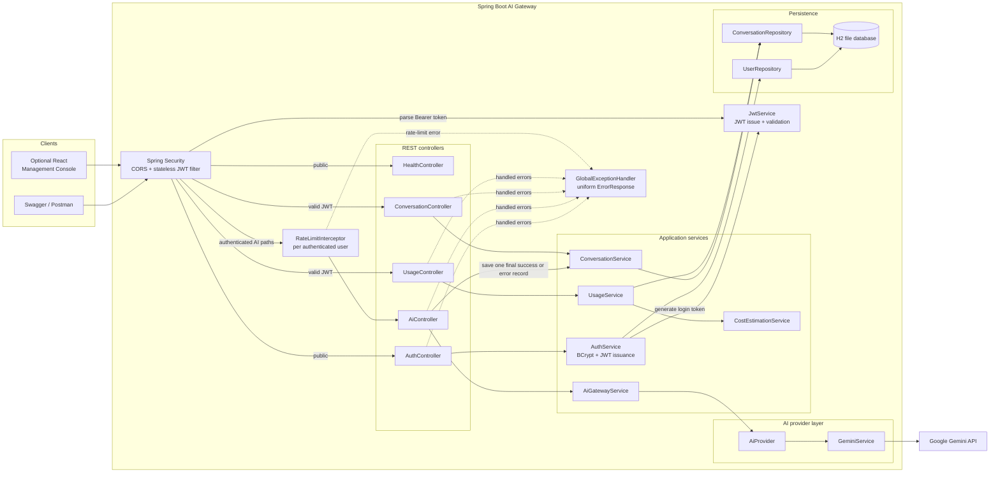

# AI Gateway Architecture

AI Gateway is a Spring Boot API that centralizes authentication, access to the configured AI provider, request persistence, aggregate usage reporting, reliability controls, and consistent error responses. The React application is an optional management console; Swagger and the Postman collection can also act as clients.

## System architecture

`AiGatewayService` depends on the `AiProvider` interface. `GeminiService` is the only provider implementation currently configured.

## AI request flow

For `POST /ai/chat` and `POST /ai/analyze`, the implemented flow is:

1. Spring Security processes CORS and the stateless JWT filter. A valid Bearer token creates an `AuthenticatedUser` principal containing the JWT `userId` and username claims.
2. The MVC `RateLimitInterceptor` applies only to the two AI routes and checks an in-memory request window keyed by the authenticated user ID.
3. `AiController` validates the request and starts client-visible latency measurement.
4. `AiController` calls `AiGatewayService`, which delegates through `AiProvider` to `GeminiService`.
5. `GeminiService` calls the configured Gemini model through the Google GenAI SDK. The SDK client is configured with an approximately 10-second timeout and at most three total attempts for configured transient failures.
6. Chat returns provider text and usage metadata. Analyze requests a four-field JSON schema and validates the returned JSON and allowed field values before creating the HTTP response.
7. After the provider operation finishes, `AiController` writes exactly one `Conversation` through `ConversationService`: `success` with response/token metadata, or `error` with the measured latency. Retry attempts do not create separate rows.
8. `AiController` emits one minimal `AI_REQUEST` log entry containing user ID, request type, provider, model, final status, and total latency.
9. `GlobalExceptionHandler` converts validation, rate-limit, timeout, provider, malformed-response, and unexpected exceptions into safe `ErrorResponse` payloads. Invalid JWT responses are produced directly by the security filter/entry point.

`GET /usage` does not call Gemini. `UsageService` reads stored conversations, aggregates requests, tokens, latency, and errors, then asks `CostEstimationService` to calculate cost only when every relevant record has valid token data and configured pricing for its provider/model pair.

## Endpoint access

Public endpoints configured in `SecurityConfig`:

- `GET /health`
- `POST /auth/register`
- `POST /auth/login`
- `/swagger-ui/**`
- `/swagger-ui.html`
- `/v3/api-docs/**`

JWT-protected endpoints:

- `POST /ai/chat`
- `POST /ai/analyze`
- `GET /conversations`
- `GET /usage`

All other unmatched requests are denied. CORS permits configured origins but does not bypass JWT authorization.

## Diagram scope

The diagram groups DTOs, individual exception classes, SDK response objects, and configuration-property classes rather than drawing each as a separate component. The provider retry and timeout behavior lives inside the Google GenAI client configuration built by `GeminiService`; rate-limit state is an in-memory `ConcurrentHashMap`, not a database table. These simplifications do not introduce additional runtime components.
