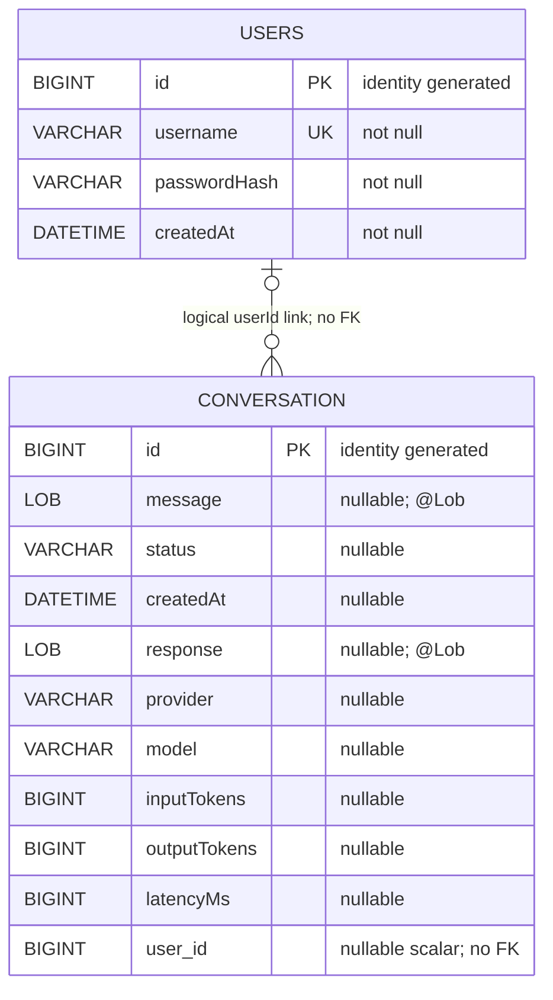

# Database Schema

The application uses two JPA entities. `User` maps explicitly through `@Table(name = "users")`; `Conversation` maps explicitly through `@Table(name = "conversation")`.

## Relationship

`Conversation.userId` stores the ID taken from the authenticated JWT principal. It is a nullable scalar `Long`, allowing legacy conversations to remain unassigned. There is no `@ManyToOne`, `@JoinColumn`, collection on `User`, or database foreign-key mapping in the source. The line in the ER diagram therefore represents only the application's logical association: a conversation may reference zero or one user ID, and a user ID may appear in zero or many conversations. Referential integrity and cascade behavior are not defined by JPA for this link.

## Indexes

- `users.username` has a unique constraint declared by `@Column(nullable = false, unique = true)`.
- `idx_conversation_user_id` is declared by `@Index` on `conversation.user_id`.

## Persistence notes

- Storage is an H2 file database configured at `jdbc:h2:file:./data/ai-gateway`.
- Spring Data JPA repositories persist both entities, and Hibernate currently uses `ddl-auto=update`.
- `User` supports authentication. `passwordHash` stores the BCrypt hash and is excluded from JSON serialization with `@JsonIgnore`.
- `Conversation` stores the AI input and response together with observability metadata.

Conversation metadata fields:

- `provider` and `model` identify the actual AI provider/model selected for the request.
- `inputTokens` and `outputTokens` contain official provider usage metadata when available.
- `latencyMs` is total client-visible AI processing time, including provider retries and backoff.
- `status` is written as `success` or `error` by the current AI controller flow.
- `createdAt` is assigned by `ConversationService` when the record is created.

Except for the generated ID, the `Conversation` fields have no explicit `nullable = false` JPA annotations. The diagram reflects that mapping and documents only the index and constraints declared in the entities; it does not introduce additional tables or a physical foreign key.
